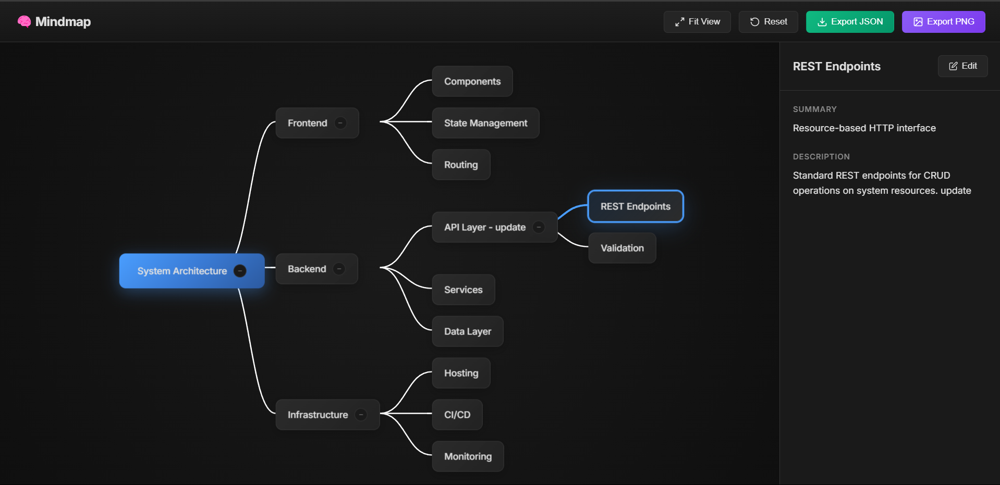

# 🧠 Interactive Mindmap UI

A data-driven, interactive mindmap visualization built with React and Vite for a frontend development internship assignment.




## ✨ Features

- **Data-Driven Rendering**: UI is generated entirely from a JSON data file
- **Interactive Nodes**: Click to select, hover for tooltips, expand/collapse children
- **Detail Panel**: View and edit node information in a sidebar
- **Pan & Zoom**: Navigate the mindmap with mouse drag and scroll
- **Export Options**: Download data as JSON or capture as PNG image
- **Dark Theme**: Modern, visually appealing design with glassmorphism effects

## 🛠️ Technologies & Libraries

| Technology | Purpose |
|------------|---------|
| **React 18** | UI framework with hooks for state management |
| **Vite** | Fast build tool and dev server |
| **Vanilla CSS** | Custom styling with CSS variables |
| **html2canvas** | Image export functionality |

**No external state management libraries** - all state is managed with React's built-in `useState` hook.

## 🏗️ Architecture Overview

```
┌─────────────────────────────────────────────────────────┐
│                        App.jsx                          │
│  ┌─────────────────────────────────────────────────┐   │
│  │ State: data, selectedNode, expandedNodes,       │   │
│  │        viewTransform, hoveredNode, editingNode  │   │
│  └─────────────────────────────────────────────────┘   │
│                         │                               │
│         ┌───────────────┼───────────────┐              │
│         ▼               ▼               ▼              │
│    ┌─────────┐   ┌──────────────┐  ┌───────────┐      │
│    │ Toolbar │   │MindmapCanvas │  │DetailPanel│      │
│    └─────────┘   └──────────────┘  └───────────┘      │
│                         │                               │
│                         ▼                               │
│                  ┌─────────────┐                       │
│                  │ MindmapNode │ (recursive)           │
│                  └─────────────┘                       │
└─────────────────────────────────────────────────────────┘
```

### Components

| Component | Responsibility |
|-----------|----------------|
| `App.jsx` | Global state, event handlers, data management |
| `Toolbar.jsx` | View controls (Fit, Reset) + Export buttons |
| `MindmapCanvas.jsx` | Layout algorithm, edge rendering, pan/zoom |
| `MindmapNode.jsx` | Individual node display, selection, toggle |
| `DetailPanel.jsx` | Node details view + editing form |

## 📊 Data Flow

```
JSON Data File
      │
      ▼
App.jsx (useState)
      │
      ├──► MindmapCanvas
      │         │
      │         └──► Tree Layout Algorithm
      │                    │
      │                    └──► Node Positions
      │                              │
      │                              └──► MindmapNode (recursive)
      │
      └──► DetailPanel (selected node)
```

### JSON Schema

```json
{
  "id": "unique-id",
  "label": "Node Label",
  "summary": "Short description (shown on hover)",
  "description": "Detailed description",
  "metadata": {
    "key": "value"
  },
  "children": [/* nested nodes */]
}
```

## 🚀 How to Run

### Prerequisites
- Node.js 18+ 
- npm or yarn

### Installation

```bash
# Clone the repository
git clone https://github.com/Rohanrathod7/MindMap.git
cd MindMap

# Install dependencies
npm install

# Start development server
npm run dev
```

The app will be available at `http://localhost:5173`

### Build for Production

```bash
npm run build
npm run preview
```

## 📸 Screenshots

### Hover Interaction


### Node Selection with Detail Panel


### Collapsed State


### Expanded State


## 🎯 Key Interactions

| Interaction | Action |
|-------------|--------|
| **Hover** | Shows tooltip with node summary |
| **Click Node** | Selects node, shows details in panel |
| **Click +/-** | Expands/collapses children |
| **Drag Canvas** | Pans the view |
| **Scroll** | Zooms in/out |
| **Edit Button** | Enables inline editing of node |
| **Export JSON** | Downloads mindmap data |
| **Export PNG** | Downloads as image |

## 📁 Project Structure

```
MindMap/
├── data/
│   └── mindmap.sample.json    # Sample data file
├── docs/
│   ├── prod-spec.md           # Product specification
│   ├── eng-des.md             # Engineering design
│   ├── data-contract.md       # JSON schema
│   └── constraints.md         # Development constraints
├── screenshots/               # UI screenshots
├── src/
│   ├── components/
│   │   ├── DetailPanel.jsx
│   │   ├── MindmapCanvas.jsx
│   │   ├── MindmapNode.jsx
│   │   └── Toolbar.jsx
│   ├── App.jsx
│   ├── App.css
│   └── main.jsx
├── index.html
├── package.json
└── README.md
```


---

Built with ❤️ for Frontend Development Internship Assignment
